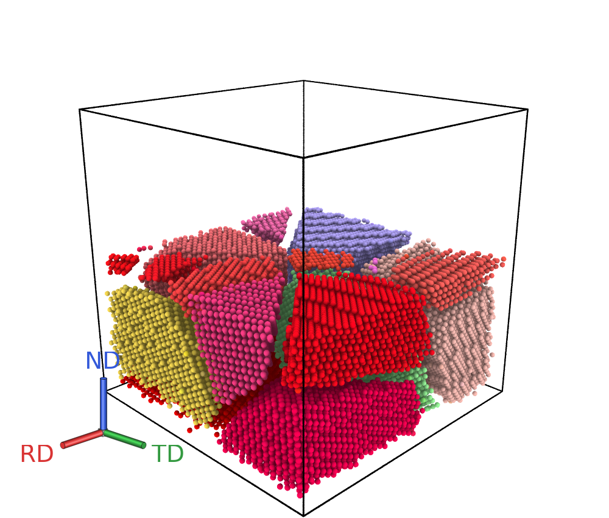
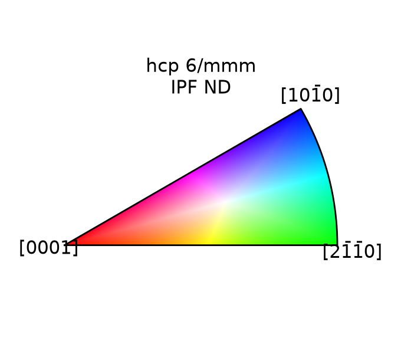
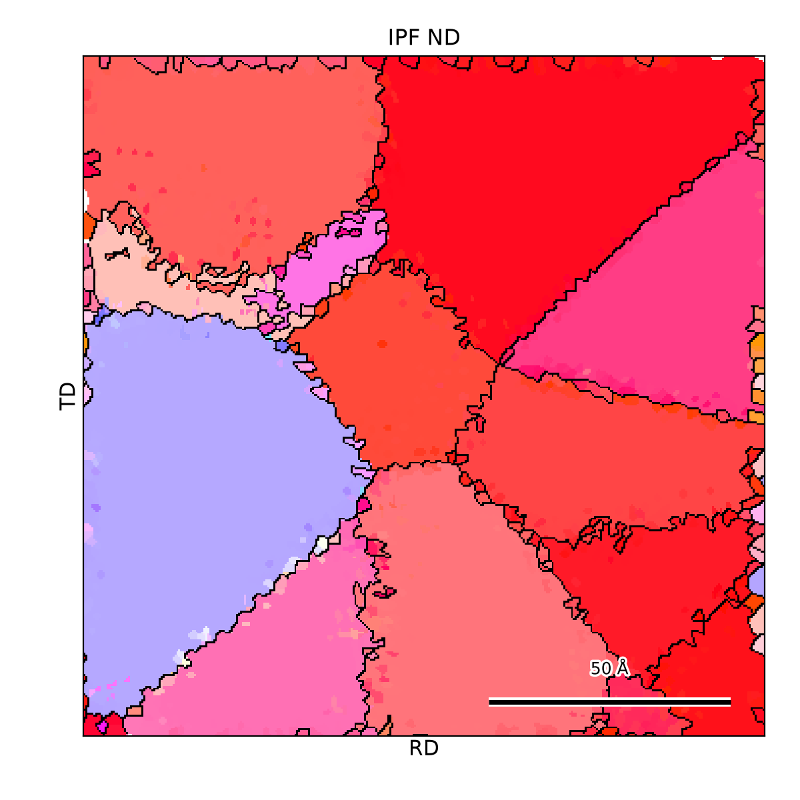
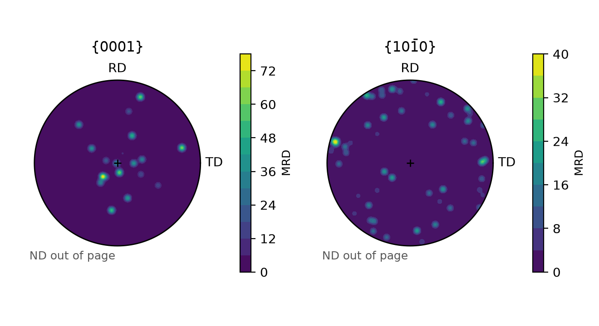
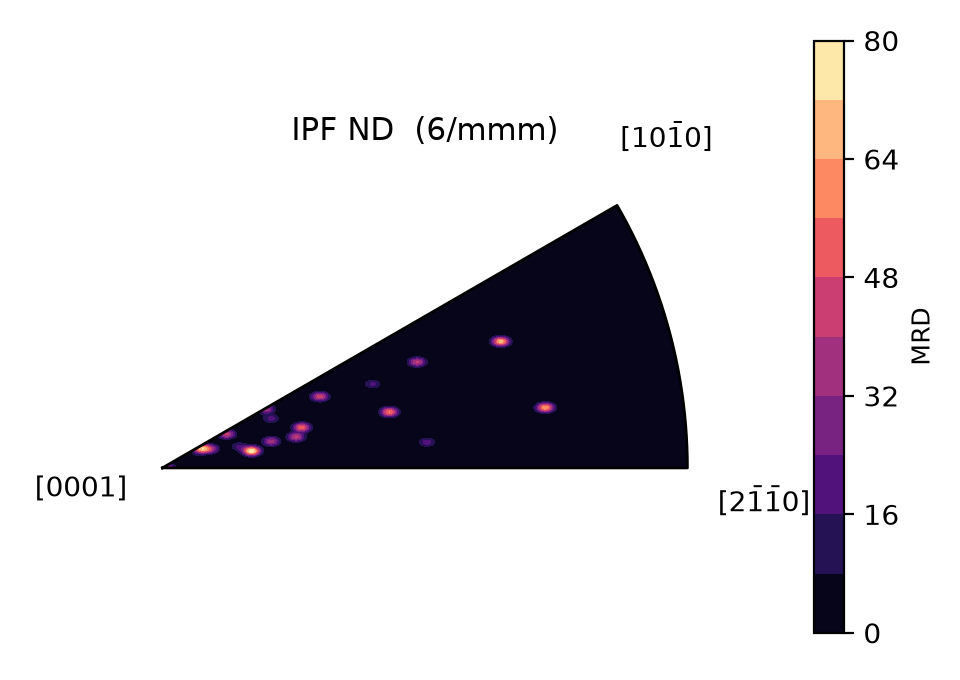
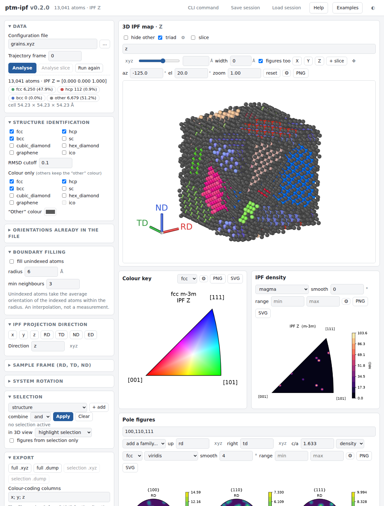

# ptm-ipf

**EBSD-style inverse pole figure colouring for atomistic simulations.**

`ptm-ipf` runs [OVITO](https://www.ovito.org)'s polyhedral template matching (PTM) on an
atomistic configuration, turns the per-atom orientation quaternions into inverse pole
figure (IPF) colours using the standard EDAX/TSL colour key, and draws the matching
colour key, pole figures and orientation densities, so a molecular dynamics
microstructure can be put side by side with an EBSD orientation map and read the same way.

<p align="center">
  
  
</p>

<p align="center"><em>A textured hcp magnesium polycrystal, cut open and coloured by
IPF-ND, with the sample triad and its colour key. Reds mean c axes near ND: the basal
texture of rolled or extruded magnesium.</em></p>

## Why

OVITO computes the orientations but does not colour them the way EBSD software does: its
[example M3](https://docs.ovito.org/python/introduction/examples/modifiers/visualize_local_lattice_orientation.html)
maps quaternions through Rodrigues space, which is a valid colouring but not an inverse
pole figure and not comparable with an EBSD map. Conversely
[MTEX](https://mtex-toolbox.github.io) and [orix](https://orix.readthedocs.io) implement
the proper IPF colour keys but work on EBSD maps, not on atoms.

`ptm-ipf` closes that gap:

* **Colours that match EBSD software.** The key is the EDAX/TSL scheme of Nolze &
  Hielscher, verified against `orix` to better than `1e-3` in RGB for every supported
  Laue group (`tests/test_orix_agreement.py`).
* **Any reference direction.** Project along a cell axis, along a named sample axis
  (`RD`, `TD`, `ND`, `ED`) that you define for your cell, or along an arbitrary vector.
* **More than cubic.** hcp, fcc, bcc, simple cubic, cubic and hexagonal diamond, and
  graphene, each with the right Laue group.
* **Pole figures too**, in the same sample frame, as equal-area MRD contour plots.
* **Verified conventions.** The PTM quaternion convention and the hcp template frame the
  colours depend on are pinned down by tests that run real PTM
  (`tests/test_ptm_convention.py`), so an OVITO change cannot silently rotate your maps.

## Install

```bash
pip install git+https://github.com/Carbonpoint/ptm-ipf.git
```

On a bare Linux machine OVITO also needs the OpenGL runtime:
`sudo apt install libopengl0 libegl1`.

## Quick start

```bash
# IPF-Z map of an hcp magnesium configuration, plus the colour key
ptmipf mg.dump -o mg_ipf.xyz --structures hcp --direction z --legend key.png
```

The output file carries the colour as three extra columns, named so that OVITO binds them
to the atoms on reload: opening `mg_ipf.xyz` or `mg_ipf.dump` shows the atoms already
coloured by orientation, with no column mapping to do by hand. To render the picture directly:

```bash
ptmipf mg.dump --structures hcp --direction nd \
    --render mg_map.png --hide-other --slice nd --render-size 1600x1200
```

### Sections

A slab a few atomic layers thick, viewed down its normal, is the atomistic equivalent of an
EBSD orientation map:

```bash
# A 10 A section through the middle of the cell, seen face on
ptmipf mg.dump --structures hcp --direction z --hide-other \
    --slice z --slice-width 10 --view z --render section.png
```

`--slice-width` is the slab thickness in angstroms (0, the default, cuts the cell in half
instead), `--slice-distance` moves the plane along its normal, and `--view` puts the camera
on an axis looking down it, orthographically, so grains appear as flat coloured regions
with the grain boundaries between them. `--view` accepts an axis, a named sample axis or a
vector, `--perspective` restores the perspective camera, and `--tripod` draws a coordinate
triad labelled with the sample axes. The web interface has the same
controls: a thickness box beside the slice slider, X/Y/Z buttons for the axial views, a
triad toggle, boundary filling, and a flat orientation map panel.

### Flat orientation maps

A section can also be rasterised into a flat map: colours and grain boundaries, no atoms,
which is what an EBSD orientation map looks like.

```bash
ptmipf mg.dump --structures hcp --direction nd --fill-boundaries 6 \
    --view nd --slice-width 10 --flat-map map.png
```

<p align="center">
  
</p>

The pixels are coloured by the orientation of the nearest atom, the pixels are then grouped
into grains, and the line between two grains is drawn as the boundary. Segmenting first is
what gives clean boundary lines rather than a scribble wherever the orientation drifts.
`--pixel-size` sets the resolution (0.5 A by default), `--boundary-angle` the misorientation
that counts as a boundary (5 degrees), and `--flat-map-raw` paints the unindexed atoms black
instead of filling the map from the indexed ones, which shows how wide the boundaries
really are.

### Filling the grain boundaries

PTM gives no orientation to disordered atoms, so grain boundaries appear as gaps. They can
be filled by averaging the orientations of the indexed atoms within a radius, in the way
EBSD software extrapolates unindexed points:

```bash
ptmipf mg.dump --structures hcp --direction nd --fill-boundaries 6 -o filled.xyz
```

`--fill-boundaries` takes the radius in angstrom (6 by default, about two atomic shells),
and `--fill-min-neighbours` refuses to fill atoms with too few indexed neighbours, which
keeps free surfaces and voids from being filled with noise. The averaging is symmetry
aware: orientations are moved to the symmetry equivalent nearest their reference before
being averaged, since the naive mean of two symmetry equivalents is meaningless.

Filled atoms are flagged in `IPFResult.interpolated`, because this is an interpolation and
not a measurement: an atom in the middle of a high angle boundary has neighbours in two
grains and its average orientation lies in neither.

### Choosing the reference direction

The direction is whatever you would project an EBSD map along. Give it as an axis, a
named sample axis, or a vector:

```bash
ptmipf mg.dump -o out.xyz --direction z          # a cell axis
ptmipf mg.dump -o out.xyz --direction 1,1,0      # an arbitrary vector
ptmipf mg.dump -o out.xyz --direction -x         # a negative axis
```

Named axes are defined once and then used by name, which is the natural way to describe a
rolled or extruded sample whose axes are not the cell axes:

```bash
# Extrusion along the cell's [110], sheet normal along z
ptmipf mg.dump -o out.xyz --ed 1,1,0 --nd 0,0,1 --direction ed
```

`--rd`, `--td` and `--nd` are completed to a right-handed orthonormal frame: give two and
the third follows, give one and the others are chosen perpendicular to it. Non-orthogonal
input is orthogonalised with a warning rather than silently accepted. `--ed` is stored as
an extra named direction, so `ED` and `RD` can differ.

### Pole figures

```bash
ptmipf mg.dump --structures hcp --direction nd --c-over-a 1.6236 \
    --pole-figure 0001 --pole-figure 10-10 --pole-figure-file pf.png \
    --ipf-density ipf_density.png
```

<p align="center">
  
  
</p>

Pole figures are Lambert equal-area projections on the upper hemisphere, contoured in
multiples of a random distribution (MRD); equal area means equal solid angle, which is
what makes MRD meaningful. Poles are given in Miller or Miller–Bravais notation
(`0001`, `10-10`, `11-20`, `111`) and are expanded over all symmetry equivalents.
Non-basal, non-prismatic hexagonal poles such as `{10-11}` depend on the axial ratio, so
pass `--c-over-a` for your material (1.6236 for magnesium; the ideal 1.633 is the default).

### Selecting atoms

Any part of a configuration can be isolated and then coloured, plotted, rendered or
exported on its own: one grain, one phase, one orientation fibre, one region of the cell,
or the well-fitted atoms only. Criteria combine with `--select-mode and|or` and can be
inverted; the fields of the composite options are separated by `|`, so a direction may
still contain commas.

```bash
# The basal-oriented grains: c axis within 15 degrees of ND
ptmipf mg.dump --structures hcp --direction nd --from-selection     --select-orientation '0001|nd|15' --selection-output basal.xyz     --pole-figure 0001 --render basal.png --hide-other

# A single grain, taken from the orientation of atom 12345, in the top of the cell
ptmipf mg.dump --structures hcp --from-selection     --select-grain 12345 --select-region 'z|60|' --ipf-density grain.png
```

| option | selects |
|---|---|
| `--select-orientation 'CRYSTAL\|SAMPLE\|TOL'` | atoms whose crystal direction (`0001`, `10-10`, `111`) lies within `TOL` degrees of a sample direction (an orientation fibre) |
| `--select-grain INDEX` | atoms whose **whole** orientation matches that of atom `INDEX`, within `--select-grain-tolerance` (one grain) |
| `--select-structure`, `--select-type` | a phase, or a chemical species |
| `--select-region 'AXIS\|MIN\|MAX'` | a slab along a cell axis, a named sample axis or a vector |
| `--select-rmsd-below F` | the well-fitted atoms, dropping the distorted first shell at a boundary |

`--from-selection` restricts `-o`, the plots and `--render` to the selection;
`--selection-output` writes just the selection while leaving everything else on the full
configuration. The difference between the two orientation queries matters: an orientation
fibre (`--select-orientation`) fixes one crystal direction and leaves the rotation about it
free, so it catches every grain sharing that texture component, while `--select-grain`
constrains the full orientation and so isolates a single grain.

### Supported structures

| structure | Laue group | red / green / blue corners |
|---|---|---|
| `hcp`, `hex_diamond`, `graphene` | `6/mmm` | `[0001]`, `[2-1-10]`, `[10-10]` |
| `fcc`, `bcc`, `sc`, `cubic_diamond` | `m-3m` | `[001]`, `[101]`, `[111]` |

`ptmipf --list-structures` prints the full list. Tetragonal (`4/mmm`), trigonal (`-3m`)
and orthorhombic (`mmm`) keys are implemented too and are available through the Python API
for orientation data from other sources.

In a multiphase configuration, identify several structures but colour only the phase of
interest:

```bash
ptmipf alloy.dump -o out.xyz --structures hcp,fcc --color-only hcp
```

## Python API

```python
from ptmipf import analyse, ipf_legend, pole_figure, get_laue_group
from ptmipf.frames import SampleFrame

frame = SampleFrame({"ed": "1,1,0", "nd": "0,0,1"})
result = analyse("mg.dump", direction="ed", structures=("hcp",), frame=frame)

print(result.summary())
colors = result.colors                  # (n, 3) RGB per atom
rotations = result.rotations("hcp")     # crystal-to-sample rotation matrices

ipf_legend("6/mmm", direction_label="ED", filename="key.png")
pole_figure(rotations, ["0001", "10-10"], "6/mmm", sample_frame=frame,
            c_over_a=1.6236, filename="pf.png")
```

Selections are boolean masks over a result, so they compose freely:

```python
from ptmipf.select import select_by_ipf_direction, select_by_rmsd, combine
from ptmipf.render import render_result

basal = select_by_ipf_direction(result, "0001", "nd", tolerance_deg=15, structure="hcp")
good = select_by_rmsd(result, maximum=0.08)

grains = result.subset(combine(basal, good))     # a new IPFResult, counts recomputed
pole_figure(grains.rotations("hcp"), "0001", "6/mmm", filename="basal_pf.png")
render_result(grains, "basal.png", hide_other=True)
```

```python
from ptmipf.fill import fill_boundary_orientations
from ptmipf.flatmap import flat_ipf_map, save_flat_map

filled = fill_boundary_orientations(result, radius=6.0)
flat = flat_ipf_map(filled, view="nd", slab_width=10.0, pixel_size=0.4)
print(f"{flat.n_grains} grains in the section")
save_flat_map(flat, "map.png")
```

`result.recolor("rd")` returns a copy projected along another direction without re-running
PTM, which is what makes an interactive front end responsive.
`ptmipf.select.misorientation_angles` gives the symmetry-reduced disorientation in degrees
against a reference orientation, a quaternion or an atom index.

The colour key is independent of OVITO, so orientations from any source can be coloured:

```python
from ptmipf import IPFColorKey, get_laue_group

key = IPFColorKey(get_laue_group("hexagonal"))
rgb = key.orientation2color(rotation_matrices, sample_direction=[0, 0, 1])
```

### Inside an OVITO pipeline

`ipf_color_modifier` returns a plain OVITO modifier function, so the colours can be part
of an existing pipeline and rendered by OVITO itself:

```python
from ovito.io import import_file
from ovito.modifiers import PolyhedralTemplateMatchingModifier
from ptmipf import ipf_color_modifier

pipeline = import_file("mg.dump")
pipeline.modifiers.append(PolyhedralTemplateMatchingModifier(output_orientation=True))
pipeline.modifiers.append(ipf_color_modifier(direction="z", structures=("hcp",)))
```

## Web interface

Everything above is also available as a local web interface, which adds no
dependencies, because the server is standard library only:

```bash
ptmipf-ui mg.dump                 # analyse and open the browser
python -m ptmipf.webui --root ~/simulations
```

[](docs/webui.md)

Load a configuration, set the structures, sample frame and projection direction, orbit and
slice the 3D view, build a selection from several criteria (including "the basal-oriented
grains" and "the grain containing this atom I clicked"), restrict the pole figures and IPF
density to it, and export everything. Changing only the projection direction re-uses the
cached PTM result, so recolouring is immediate. The *CLI command* button prints the
`ptmipf` command line that reproduces the session, so exploration turns straight into a
scriptable analysis. See [docs/webui.md](docs/webui.md) for the full tour.

## Conventions

These were determined empirically from OVITO and are asserted by the test suite:

* OVITO stores the PTM orientation as a quaternion in `(x, y, z, w)` order, and the
  rotation it represents maps the **crystal (template) frame onto the sample frame**.
  The direction shown in an inverse pole figure is therefore `Rᵀ d`, not `R d`.
* The hexagonal templates have **c along z and a₁ along x**; the cubic templates have
  their crystal axes along the Cartesian axes.
* Orientations are reduced into the fundamental zone by PTM, and the colour key is
  invariant under the Laue group, so the reduction does not affect the colours.

## Limitations

* PTM assigns no orientation to disordered atoms, so grain boundary and surface atoms are
  drawn in the `--other-color` grey (or hidden with `--hide-other`). In the example above
  that is about a third of the atoms, which is normal for a nanocrystal.
* Icosahedral environments have no crystallographic orientation and are never coloured.
* The pole figure density is a Gaussian kernel on the equal-area plane, which is fine for
  inspection but is not a spherical harmonic ODF; use MTEX for quantitative texture
  analysis.
* PTM's hexagonal templates assume a near-ideal axial ratio. `--c-over-a` affects pole
  positions, not the identification itself.

## Citing

If this tool is useful in published work, please cite PTM (Larsen, Schmidt & Schiøtz,
*Modelling Simul. Mater. Sci. Eng.* **24** (2016) 055007), OVITO (Stukowski,
*Modelling Simul. Mater. Sci. Eng.* **18** (2010) 015012) and the colour key
(Nolze & Hielscher, *J. Appl. Cryst.* **49** (2016) 1786). See `CITATION.cff`.

## Licence and acknowledgements

GPL-3.0-or-later. The inverse pole figure colour key follows the scheme described by
Nolze & Hielscher and implemented in [MTEX](https://mtex-toolbox.github.io) and
[orix](https://orix.readthedocs.io); it is reimplemented here in NumPy so that millions of
atoms can be coloured quickly, and the GPL is inherited from that lineage. `orix` is used
in the test suite as the reference implementation.
