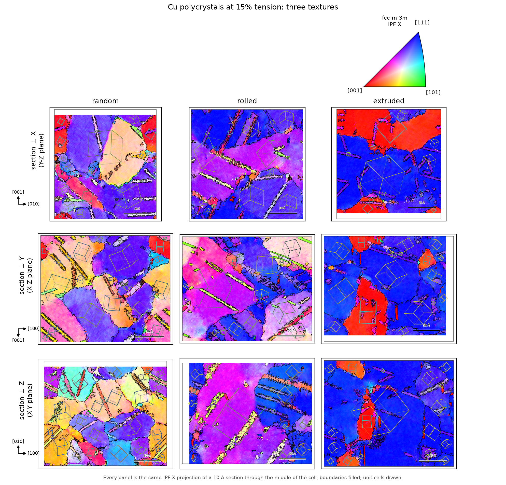

# ptm-ipf

**EBSD-style inverse pole figure colouring for atomistic simulations.**

`ptm-ipf` runs [OVITO](https://www.ovito.org)'s polyhedral template matching (PTM) on an
atomistic configuration, turns the per-atom orientation quaternions into inverse pole
figure (IPF) colours using the standard EDAX/TSL colour key, and draws the matching
colour key, pole figures and orientation densities, so a molecular dynamics
microstructure can be put side by side with an EBSD orientation map and read the same way.

<p align="center">
  
  
</p>

<p align="center"><em>A textured hcp magnesium polycrystal, cut open and coloured by
IPF-ND, with the sample triad and its colour key. Reds mean c axes near ND: the basal
texture of rolled or extruded magnesium.</em></p>

## Why

OVITO computes the orientations but does not colour them the way EBSD software does: its
[example M3](https://docs.ovito.org/python/introduction/examples/modifiers/visualize_local_lattice_orientation.html)
maps quaternions through Rodrigues space, which is a valid colouring but not an inverse
pole figure and not comparable with an EBSD map. Conversely
[MTEX](https://mtex-toolbox.github.io) and [orix](https://orix.readthedocs.io) implement
the proper IPF colour keys but work on EBSD maps, not on atoms.

`ptm-ipf` closes that gap:

* **Colours that match EBSD software.** The key is the EDAX/TSL scheme of Nolze &
  Hielscher, verified against `orix` to better than `1e-3` in RGB for every supported
  Laue group (`tests/test_orix_agreement.py`).
* **Any reference direction.** Project along a cell axis, along a named sample axis
  (`RD`, `TD`, `ND`, `ED`) that you define for your cell, or along an arbitrary vector.
* **More than cubic.** hcp, fcc, bcc, simple cubic, cubic and hexagonal diamond, and
  graphene, each with the right Laue group.
* **Pole figures too**, in the same sample frame, as equal-area MRD contour plots.
* **Verified conventions.** The PTM quaternion convention and the hcp template frame the
  colours depend on are pinned down by tests that run real PTM
  (`tests/test_ptm_convention.py`), so an OVITO change cannot silently rotate your maps.

## Install

### Linux and macOS

These steps are for Linux and macOS. Windows is a separate section below, because
PowerShell needs the steps one per line. Each block is one command, so the copy
button on the right of the block copies exactly what you paste.

With [uv](https://docs.astral.sh/uv/), recommended: it installs the whole environment
in seconds. Make the environment:

```bash
uv venv
```

Install ptm-ipf into it:

```bash
uv pip install git+https://github.com/Carbonpoint/ptm-ipf.git
```

Or, with pip instead of uv:

```bash
pip install git+https://github.com/Carbonpoint/ptm-ipf.git
```

Both forms fetch the repository, so Git must be on the PATH:

```bash
sudo apt install git
```

Without Git, download the repository as a ZIP and run `uv pip install .` in the
unpacked folder. On a bare Linux machine OVITO also needs the OpenGL runtime:

```bash
sudo apt install libopengl0 libegl1
```

Without root, a symlink works instead: `ln -s /usr/lib/x86_64-linux-gnu/libGL.so.1
<somewhere>/libOpenGL.so.0`, then run with `LD_LIBRARY_PATH=<somewhere>`.

Check the installation, which also reports whether Git was found:

```bash
ptmipf-ui --check
```

### Windows

PowerShell has no `&&`, so every step is its own command. Run them in the folder you
want the environment in.

If Git is missing, install it first. `git+https://...` cannot fetch the repository
without it:

```powershell
winget install Git.Git
```

Make the environment:

```powershell
uv venv
```

Install ptm-ipf into it:

```powershell
uv pip install git+https://github.com/Carbonpoint/ptm-ipf.git
```

Self test: it reports whether Git, OVITO and the 3D view are working, and names what
is missing if not:

```powershell
.venv\Scripts\ptmipf-ui.exe --check
```

Start the interface in the current folder. It opens in your browser, and you can
point it at another folder from inside it:

```powershell
.venv\Scripts\ptmipf-ui.exe
```

Or start it on one file:

```powershell
.venv\Scripts\ptmipf-ui.exe mg.dump
```

The command line tool works the same way:

```powershell
.venv\Scripts\ptmipf.exe mg.dump --structures hcp --direction z --legend key.png
```

Calling the executables in `.venv\Scripts` directly avoids activating the environment,
which PowerShell refuses to do under its default execution policy. To activate anyway,
run `Set-ExecutionPolicy -Scope Process -ExecutionPolicy Bypass` and then
`.venv\Scripts\Activate.ps1`.

OVITO's Windows wheels carry their own graphics stack, so there is no OpenGL step to
do by hand.

### For development

Clone the repository:

```bash
git clone https://github.com/Carbonpoint/ptm-ipf.git
```

Then, in the `ptm-ipf` folder, make the environment:

```bash
uv venv
```

Install it in place, with the test extras:

```bash
uv pip install -e ".[test]"
```

Run the tests:

```bash
uv run --no-project pytest -q
```

## Quick start

```bash
# IPF-Z map of an hcp magnesium configuration, plus the colour key
ptmipf mg.dump -o mg_ipf.xyz --structures hcp --direction z --legend key.png
```

The output file carries the colour as three extra columns, named so that OVITO binds them
to the atoms on reload: opening `mg_ipf.xyz` or `mg_ipf.dump` shows the atoms already
coloured by orientation, with no column mapping to do by hand. To render the picture directly:

```bash
ptmipf mg.dump --structures hcp --direction nd \
    --render mg_map.png --hide-other --slice nd --render-size 1600x1200
```

### Three IPF maps in one file, recoloured inside OVITO

`Color.R/G/B` fixes one projection direction at export time, and OVITO's own Color
coding modifier cannot read a colour triple: it maps *one scalar per atom* through a
colour bar. So every output file also carries a scalar column per direction, `ipf_x`,
`ipf_y` and `ipf_z` by default, and a colour bar that turns them back into exactly the
IPF colours:

```bash
ptmipf mg.dump --structures hcp -o mg_ipf.dump
# wrote mg_ipf.dump (lammps-dump)
# colour-coding columns: ipf_x (X), ipf_y (Y), ipf_z (Z)
# wrote mg_ipf_colormap.png (18422 colours, worst colour error 0.0019)
```

In OVITO, on the loaded file:

1. add a **Color coding** modifier,
2. set **Input property** to `ipf_x`, `ipf_y` or `ipf_z`,
3. set the range to **0** and **1** (not "Adjust range"),
4. open the colour gradient list, choose **Load custom color map**, and pick
   `mg_ipf_colormap.png`.

Switching the input property between the three columns now switches between IPF-X,
IPF-Y and IPF-Z with no re-export. The colours are the same ones the colour key and the
pole figures use, to within the 8-bit depth of the file, which
`tests/test_colormap.py` checks by running the modifier and comparing.

Pick your own directions with `--export-direction`, repeated:

```bash
ptmipf mg.dump --structures hcp --nd 0,0,1 --rd 1,0,0 -o mg_ipf.dump \
    --export-direction rd --export-direction td --export-direction nd
```

`--no-export-directions` writes the plain file with `Color.R/G/B` only.

A stock colour bar can stand in for the custom one with
`--color-map-gradient jet` (or `rainbow`, `viridis`, ...), which needs no extra file.
It is an approximation and is reported as one: a built-in bar is a one-dimensional curve
through colour space while the IPF colours cover a two-dimensional patch of it, so most
IPF colours simply are not on the curve. For a full IPF map the error is large enough to
change which grain looks like which, so it is worth the extra file to load the custom map.

### Something to try it on

`ptmipf-example` writes a complete small study: a random polycrystal, its EAM
potential fetched from the
[NIST Interatomic Potentials Repository](https://www.ctcms.nist.gov/potentials/),
and a LAMMPS input that compresses it.

```bash
ptmipf-example Cu                 # or Al, Ni, Fe
cd examples/cu_6grain_compression
lmp -in in.compression            # about 90 s on four cores
ptmipf compression.dump --structures fcc --direction z --legend key.png
```

The geometry is built by [atomsk](https://atomsk.univ-lille.fr), which is not a
Python package and does not arrive with `pip install`: get it from
<https://atomsk.univ-lille.fr/dl.php>, which has Linux, macOS and Windows
binaries, and put it on the PATH or point `PTMIPF_ATOMSK` at it. `--builder
voronoi` uses a built-in NumPy fallback instead, and everything it writes says
so, because a builder that leaves the grain boundaries too open softens the
elastic response and brings yield forward. That is not a hypothetical: rebuilding
the iron runs of the showcase campaign on atomsk moved the peak stress of a
random cell from 4.99 to 5.94 GPa.

The same thing is a button on the web interface's *Examples* page.

### Orientations from somewhere else

A configuration another OVITO session has already run PTM on carries the
quaternions, so there is no reason to run PTM again:

```python
from ptmipf.analysis import analyse_orientations, list_columns

print(list_columns("from_elsewhere.dump")["columns"])
result = analyse_orientations(
    "from_elsewhere.dump",
    {"quaternion": ["qw", "qx", "qy", "qz"], "order": "wxyz", "structure_type": "phase"},
    direction="z",
)
```

`quaternion` takes one four-component column or four scalar ones, and `order` is
`xyzw` (OVITO's own, and the default) or `wxyz`. Set `conjugate` for a file that
stores the sample to crystal rotation. Nothing in a file states either of those,
and both differ from their opposite by a transpose, which turns an IPF map into a
plausible looking but wrong one, so neither is guessed. The web interface has the
same thing as a column mapping panel with the file's real column names in it.

### Sections

A slab a few atomic layers thick, viewed down its normal, is the atomistic equivalent of an
EBSD orientation map:

```bash
# A 10 A section through the middle of the cell, seen face on
ptmipf mg.dump --structures hcp --direction z --hide-other \
    --slice z --slice-width 10 --view z --render section.png
```

`--slice-width` is the slab thickness in angstroms (0, the default, cuts the cell in half
instead), `--slice-distance` moves the plane along its normal, and `--view` puts the camera
on an axis looking down it, orthographically, so grains appear as flat coloured regions
with the grain boundaries between them. `--view` accepts an axis, a named sample axis or a
vector, `--perspective` restores the perspective camera, and `--tripod` draws a coordinate
triad labelled with the sample axes (`--tripod-axes 'x;y;1,1,0=loading'` shows other
directions, each with an optional label). The web interface has the same controls: a
thickness box and a number box beside the slice slider, X/Y/Z buttons for the axial views,
a triad toggle with size and position sliders, boundary filling, and an IPF map panel.

Two more options change what is analysed rather than what is drawn. `--rotate AXIS:DEGREES`
turns the whole system (atoms, orientations and cell) about the cell centre before
colouring, with the sample frame staying put; it is repeatable and applied in order, so
`--rotate z:45 --rotate 1,1,0:90` is a rotation about z followed by one about [110].
`--ptm-slice` runs PTM only on the `--slice` slab (`--slice-distance` places it,
`--slice-width` gives it a thickness) plus a margin so the faces are matched correctly, and
keeps only the slab: everything written afterwards is of that slab, and a large cell is
analysed in a fraction of the time.

### Flat orientation maps

A section can also be rasterised into a flat map: colours and grain boundaries, no atoms,
which is what an EBSD orientation map looks like.

```bash
ptmipf mg.dump --structures hcp --direction nd --fill-boundaries 6 \
    --view nd --slice-width 10 --flat-map map.png
```

<p align="center">
  
</p>

The pixels are coloured by the orientation of the nearest atom, the pixels are then grouped
into grains, and the line between two grains is drawn as the boundary. Segmenting first is
what gives clean boundary lines rather than a scribble wherever the orientation drifts.
`--pixel-size` sets the resolution (0.5 A by default), `--boundary-angle` the misorientation
that counts as a boundary (5 degrees), and `--flat-map-raw` paints the unindexed atoms black
instead of filling the map from the indexed ones, which shows how wide the boundaries
really are.

### Unit cell wireframes

A flat map can carry a unit cell on each grain: a hexagonal prism for hcp or a cube for
cubic, rotated into the grain's mean orientation and projected onto the section, with the
far edges drawn fainter. It shows the whole orientation where the colour shows one
direction, which is how EBSD software annotates a map.

```bash
ptmipf mg.dump --structures hcp --direction nd --fill-boundaries 6 \
    --view nd --slice-width 10 --flat-map map.png --wireframes
```

Grains within `--wireframe-tolerance` (5 degrees) count as one orientation, and grains
smaller than `--wireframe-min-area` pixels get no cell. By default each cell is sized in
proportion to the square root of its grain's area, so it stays readable on a small grain
without dominating a large one; `--wireframe-size` fixes the edge length in angstrom and
`--wireframe-scale` multiplies either. `--wireframe-color` is `invert`, the inverse of the
grain colour underneath, or any matplotlib colour. `--wireframe-one-per-orientation` draws
one cell per orientation class on its largest grain.

```python
from ptmipf.wireframe import grain_wireframes

frames = grain_wireframes(flat, tolerance_deg=5, color="invert", c_over_a=1.6236)
save_flat_map(flat, "map.png", wireframes=frames)
```

### Colouring the boundaries by misorientation

The boundaries of a flat map can be coloured by the angle across them, on a colour
scale over a chosen range, or split at a threshold into high and low angle boundaries:

```bash
# boundaries on a 0 to 90 degree colour scale, with a colour bar
ptmipf mg.dump --structures hcp --direction nd --view nd --slice-width 10 \
    --flat-map map.png --boundary-scale 0,90 --boundary-cmap plasma --boundary-width 2

# high angle boundaries (15 degrees and above) black, the rest hidden
ptmipf mg.dump ... --flat-map map.png --boundary-threshold 15 --boundary-high-color black

# the same, but measuring the tilt of the c axis across each boundary
ptmipf mg.dump ... --flat-map map.png --boundary-scale 0,90 --boundary-axis 0001
```

The angle is the disorientation between the two grains' mean orientations, reduced by
the crystal symmetry, so a boundary has one angle along its length rather than
pixel-to-pixel noise. `--boundary-axis` measures the angle between one crystal axis in
the two grains instead, which for hexagonal metals is the c axis tilt, the quantity that
separates a twin from a slightly rotated neighbour. `--boundary-low-color` draws the
boundaries below the threshold too, faintly for instance; without it they take the grain
colour and vanish.

```python
from ptmipf import boundaries

rgb = boundaries.color_boundaries_by_angle(flat, vmin=0, vmax=90, cmap="plasma", width=2)
c_tilt = boundaries.boundary_axis_angles(flat, "0001", c_over_a=1.6236)
rgb = boundaries.color_boundaries_by_threshold(flat, 15, "black", "white", angles=c_tilt)
save_flat_map(flat, "map.png", rgb=rgb, colorbar=(0, 90, "plasma", "misorientation"))
```

### Animations

A deformation trajectory can be animated as the same section through every frame, as a
flat map or as rendered atoms, with the strain stamped on each frame:

```python
from ptmipf.animate import frame_files, animate_flat_map, animate_render

files = frame_files("run.*.dump")          # sorted by step number
animate_flat_map(files, "twins.mp4", direction="x", view="z", rate=0.001,
                 boundary_scale=(0, 60, "plasma"), wireframes=True, workers=8)
animate_render(files, "cell.gif", view="z", slab_width=10, fill=6, rate=0.001)
```

Or from the command line, with the frames given as a quoted glob:

```bash
ptmipf 'run.*.dump' --structures fcc,hcp,bcc --direction x --view z --slice-width 10 \
    --fill-boundaries 6 --boundary-scale 0,60 --wireframes --strain-rate 0.001 \
    --animate twins.mp4 --workers 8
```

Frames are padded to a common size rather than resized, so the scale bar stays honest as
the cell deforms. MP4 output needs `pip install 'imageio[ffmpeg]'` (or install ptm-ipf with
its `video` extra, `uv tool install 'ptm-ipf[video]'`); GIF needs only Pillow.

### Filling the grain boundaries

PTM gives no orientation to disordered atoms, so grain boundaries appear as gaps. They can
be filled by averaging the orientations of the indexed atoms within a radius, in the way
EBSD software extrapolates unindexed points:

```bash
ptmipf mg.dump --structures hcp --direction nd --fill-boundaries 6 -o filled.xyz
```

`--fill-boundaries` takes the radius in angstrom (6 by default, about two atomic shells),
and `--fill-min-neighbours` refuses to fill atoms with too few indexed neighbours, which
keeps free surfaces and voids from being filled with noise. The averaging is symmetry
aware: orientations are moved to the symmetry equivalent nearest their reference before
being averaged, since the naive mean of two symmetry equivalents is meaningless.

Filled atoms are flagged in `IPFResult.interpolated`, because this is an interpolation and
not a measurement: an atom in the middle of a high angle boundary has neighbours in two
grains and its average orientation lies in neither.

### Choosing the reference direction

The direction is whatever you would project an EBSD map along. Give it as an axis, a
named sample axis, or a vector:

```bash
ptmipf mg.dump -o out.xyz --direction z          # a cell axis
ptmipf mg.dump -o out.xyz --direction 1,1,0      # an arbitrary vector
ptmipf mg.dump -o out.xyz --direction -x         # a negative axis
```

Named axes are defined once and then used by name, which is the natural way to describe a
rolled or extruded sample whose axes are not the cell axes:

```bash
# Extrusion along the cell's [110], sheet normal along z
ptmipf mg.dump -o out.xyz --ed 1,1,0 --nd 0,0,1 --direction ed
```

`--rd`, `--td` and `--nd` are completed to a right-handed orthonormal frame: give two and
the third follows, give one and the others are chosen perpendicular to it. Non-orthogonal
input is orthogonalised with a warning rather than silently accepted. `--ed` is stored as
an extra named direction, so `ED` and `RD` can differ.

### Pole figures

```bash
ptmipf mg.dump --structures hcp --direction nd --c-over-a 1.6236 \
    --pole-figure 0001 --pole-figure 10-10 --pole-figure-file pf.png \
    --ipf-density ipf_density.png
```

<p align="center">
  
  
</p>

Pole figures are Lambert equal-area projections on the upper hemisphere, contoured in
multiples of a random distribution (MRD); equal area means equal solid angle, which is
what makes MRD meaningful. Poles are given in Miller or Miller–Bravais notation
(`0001`, `10-10`, `11-20`, `111`) and are expanded over all symmetry equivalents.
Non-basal, non-prismatic hexagonal poles such as `{10-11}` depend on the axial ratio, so
pass `--c-over-a` for your material (1.6236 for magnesium; the ideal 1.633 is the default).

#### Smoothing, and why it is off by default

A simulated cell holds a few dozen grains at most and each one is nearly perfect, so its
poles arrive as very sharp spots and the peak MRD comes out far above anything an EBSD
map of the same texture would report. A dozen random cubic grains give a `{111}` peak
near 30 MRD unsmoothed and under 7 at five degrees, which is the range measured textures
actually live in.

```bash
ptmipf mg.dump --structures hcp --pole-figure 0001 --pole-figure-file pf.png     --pole-figure-smoothing 5 --pole-figure-cmap jet
```

`--pole-figure-smoothing` is a Gaussian standard deviation in **degrees**, added in
quadrature to the kernel the density estimate already uses. It is off by default and the
figure is annotated with the width that was used, because a peak height means something
different at ten degrees than at none. `--ipf-density-smoothing` does the same for the
IPF density plot.

The conversion from degrees is exact at the centre of the projection. Away from it the
kernel becomes elliptical, compressed radially and stretched tangentially by up to
`sqrt(2)` each way at the rim; the two are exact reciprocals, which is the projection
being equal-area, so the solid angle the kernel spreads over is right everywhere and only
its shape drifts. At the few degrees this is meant for that is not visible.

#### Colour scales

`--pole-figure-cmap` and `--ipf-density-cmap` take any matplotlib colour map name
(`viridis`, `magma`, `jet`, `rainbow`, `turbo`, `coolwarm`, ...), or a path:

```bash
ptmipf mg.dump --structures hcp --pole-figure 0001 --pole-figure-file pf.png     --pole-figure-cmap ./scale_from_the_paper.png
```

A path may be an image strip, read left to right, or a text file of RGB triples one per
line in 0 to 1 or 0 to 255. So a screenshot of the colour bar in the paper you are
comparing against works, and so does the colour map this tool writes for OVITO. The web
interface has the same menu on both plots, with an *upload your own* entry.

### Selecting atoms

Any part of a configuration can be isolated and then coloured, plotted, rendered or
exported on its own: one grain, one phase, one orientation fibre, one region of the cell,
or the well-fitted atoms only. Criteria combine with `--select-mode and|or` and can be
inverted; the fields of the composite options are separated by `|`, so a direction may
still contain commas.

```bash
# The basal-oriented grains: c axis within 15 degrees of ND
ptmipf mg.dump --structures hcp --direction nd --from-selection     --select-orientation '0001|nd|15' --selection-output basal.xyz     --pole-figure 0001 --render basal.png --hide-other

# A single grain, taken from the orientation of atom 12345, in the top of the cell
ptmipf mg.dump --structures hcp --from-selection     --select-grain 12345 --select-region 'z|60|' --ipf-density grain.png
```

| option | selects |
|---|---|
| `--select-orientation 'CRYSTAL\|SAMPLE\|TOL'` | atoms whose crystal direction (`0001`, `10-10`, `111`) lies within `TOL` degrees of a sample direction (an orientation fibre) |
| `--select-grain INDEX` | atoms whose **whole** orientation matches that of atom `INDEX`, within `--select-grain-tolerance` (one grain) |
| `--select-structure`, `--select-type` | a phase, or a chemical species |
| `--select-region 'AXIS\|MIN\|MAX'` | a slab along a cell axis, a named sample axis or a vector |
| `--select-rmsd-below F` | the well-fitted atoms, dropping the distorted first shell at a boundary |

`--from-selection` restricts `-o`, the plots and `--render` to the selection;
`--selection-output` writes just the selection while leaving everything else on the full
configuration. The difference between the two orientation queries matters: an orientation
fibre (`--select-orientation`) fixes one crystal direction and leaves the rotation about it
free, so it catches every grain sharing that texture component, while `--select-grain`
constrains the full orientation and so isolates a single grain.

### Supported structures

| structure | Laue group | red / green / blue corners |
|---|---|---|
| `hcp`, `hex_diamond`, `graphene` | `6/mmm` | `[0001]`, `[2-1-10]`, `[10-10]` |
| `fcc`, `bcc`, `sc`, `cubic_diamond` | `m-3m` | `[001]`, `[101]`, `[111]` |

`ptmipf --list-structures` prints the full list. Tetragonal (`4/mmm`), trigonal (`-3m`)
and orthorhombic (`mmm`) keys are implemented too and are available through the Python API
for orientation data from other sources.

In a multiphase configuration, identify several structures but colour only the phase of
interest:

```bash
ptmipf alloy.dump -o out.xyz --structures hcp,fcc --color-only hcp
```

## Python API

```python
from ptmipf import analyse, ipf_legend, pole_figure, get_laue_group
from ptmipf.frames import SampleFrame

frame = SampleFrame({"ed": "1,1,0", "nd": "0,0,1"})
result = analyse("mg.dump", direction="ed", structures=("hcp",), frame=frame)

print(result.summary())
colors = result.colors                  # (n, 3) RGB per atom
rotations = result.rotations("hcp")     # crystal-to-sample rotation matrices

ipf_legend("6/mmm", direction_label="ED", filename="key.png")
pole_figure(rotations, ["0001", "10-10"], "6/mmm", sample_frame=frame,
            c_over_a=1.6236, filename="pf.png")
```

Selections are boolean masks over a result, so they compose freely:

```python
from ptmipf.select import select_by_ipf_direction, select_by_rmsd, combine
from ptmipf.render import render_result

basal = select_by_ipf_direction(result, "0001", "nd", tolerance_deg=15, structure="hcp")
good = select_by_rmsd(result, maximum=0.08)

grains = result.subset(combine(basal, good))     # a new IPFResult, counts recomputed
pole_figure(grains.rotations("hcp"), "0001", "6/mmm", filename="basal_pf.png")
render_result(grains, "basal.png", hide_other=True)
```

```python
from ptmipf.fill import fill_boundary_orientations
from ptmipf.flatmap import flat_ipf_map, save_flat_map

filled = fill_boundary_orientations(result, radius=6.0)
flat = flat_ipf_map(filled, view="nd", slab_width=10.0, pixel_size=0.4)
print(f"{flat.n_grains} grains in the section")
save_flat_map(flat, "map.png")
```

`result.recolor("rd")` returns a copy projected along another direction without re-running
PTM, which is what makes an interactive front end responsive.
`ptmipf.select.misorientation_angles` gives the symmetry-reduced disorientation in degrees
against a reference orientation, a quaternion or an atom index.

The colour key is independent of OVITO, so orientations from any source can be coloured:

```python
from ptmipf import IPFColorKey, get_laue_group

key = IPFColorKey(get_laue_group("hexagonal"))
rgb = key.orientation2color(rotation_matrices, sample_direction=[0, 0, 1])
```

### Inside an OVITO pipeline

`ipf_color_modifier` returns a plain OVITO modifier function, so the colours can be part
of an existing pipeline and rendered by OVITO itself:

```python
from ovito.io import import_file
from ovito.modifiers import PolyhedralTemplateMatchingModifier
from ptmipf import ipf_color_modifier

pipeline = import_file("mg.dump")
pipeline.modifiers.append(PolyhedralTemplateMatchingModifier(output_orientation=True))
pipeline.modifiers.append(ipf_color_modifier(direction="z", structures=("hcp",)))
```

## Web interface

Everything above is also available as a local web interface, which adds no
dependencies, because the server is standard library only:

```bash
ptmipf-ui mg.dump                 # analyse and open the browser
python -m ptmipf.webui --root ~/simulations
```

[](docs/webui.md)

Load a configuration, set the structures, sample frame and projection direction, orbit and
slice the 3D view (the slice applies to the pole figures, IPF density and IPF map too, and
*Analyse slice* runs PTM on just that slab), rotate the whole system about any axis, build
a selection from several criteria (including "the basal-oriented grains" and "the grain
containing this atom I clicked"), restrict the pole figures and IPF density to it, and
export everything as PNG or SVG at a chosen resolution (300 or 600 dpi at journal
widths, HD, 4K, or your own). Changing only the projection direction or a rotation
re-uses the cached PTM result, so recolouring is immediate. The analysis runs in its own
process, so a long run can be stopped outright and started again from scratch. A numbered file series is
stepped through with arrows, and the *Render series* card writes stills or a GIF/MP4 of
any of the views for a range of frames. The *CLI command* button prints the `ptmipf`
command line that reproduces the session, so exploration turns straight into a scriptable
analysis, and *Save session* writes the whole state of the page, camera and slices
included, to a file that puts it all back later. The file browser opens any folder on
the machine, not only the one the server was started in, and every control carries a
tooltip. See [docs/webui.md](docs/webui.md) for the full tour.

## Showcase

`docs/showcase/` holds a set of deformation simulations run to show the tool on materials
the reader can check against the literature: Cu (Mishin 2001), Fe (Mendelev 2003) and Ti
(Mendelev 2016) polycrystals of 400k to 650k atoms in random, rolled and extruded textures,
in tension and compression. Every starting structure was built from explicit rotation
matrices recorded beside it, and ptm-ipf recovers every built grain to within 0.001 degrees.

[](docs/showcase/README.md)

The same IPF-X projection of the same three sections through three copper cells at 15
percent tension: random, rolled and extruded textures. The unit cell on each grain shows
the texture, the boundaries show the twins. The rolled cell twins three times as much in
tension as in compression, the extruded cell the other way round, and both are the signs
crystal plasticity predicts from the Schmid factors of the partial dislocations.

## Conventions

These were determined empirically from OVITO and are asserted by the test suite:

* OVITO stores the PTM orientation as a quaternion in `(x, y, z, w)` order, and the
  rotation it represents maps the **crystal (template) frame onto the sample frame**.
  The direction shown in an inverse pole figure is therefore `Rᵀ d`, not `R d`.
* The hexagonal templates have **c along z and a₁ along x**; the cubic templates have
  their crystal axes along the Cartesian axes.
* Orientations are reduced into the fundamental zone by PTM, and the colour key is
  invariant under the Laue group, so the reduction does not affect the colours.

## Limitations

* PTM assigns no orientation to disordered atoms, so grain boundary and surface atoms are
  drawn in the `--other-color` grey (or hidden with `--hide-other`). In the example above
  that is about a third of the atoms, which is normal for a nanocrystal.
* Icosahedral environments have no crystallographic orientation and are never coloured.
* The pole figure density is a Gaussian kernel on the equal-area plane, which is fine for
  inspection but is not a spherical harmonic ODF; use MTEX for quantitative texture
  analysis.
* PTM's hexagonal templates assume a near-ideal axial ratio. `--c-over-a` affects pole
  positions, not the identification itself.

## Citing

If this tool is useful in published work, please cite PTM (Larsen, Schmidt & Schiøtz,
*Modelling Simul. Mater. Sci. Eng.* **24** (2016) 055007), OVITO (Stukowski,
*Modelling Simul. Mater. Sci. Eng.* **18** (2010) 015012) and the colour key
(Nolze & Hielscher, *J. Appl. Cryst.* **49** (2016) 1786). See `CITATION.cff`.

## Licence and acknowledgements

GPL-3.0-or-later. The inverse pole figure colour key follows the scheme described by
Nolze & Hielscher and implemented in [MTEX](https://mtex-toolbox.github.io) and
[orix](https://orix.readthedocs.io); it is reimplemented here in NumPy so that millions of
atoms can be coloured quickly, and the GPL is inherited from that lineage. `orix` is used
in the test suite as the reference implementation.
