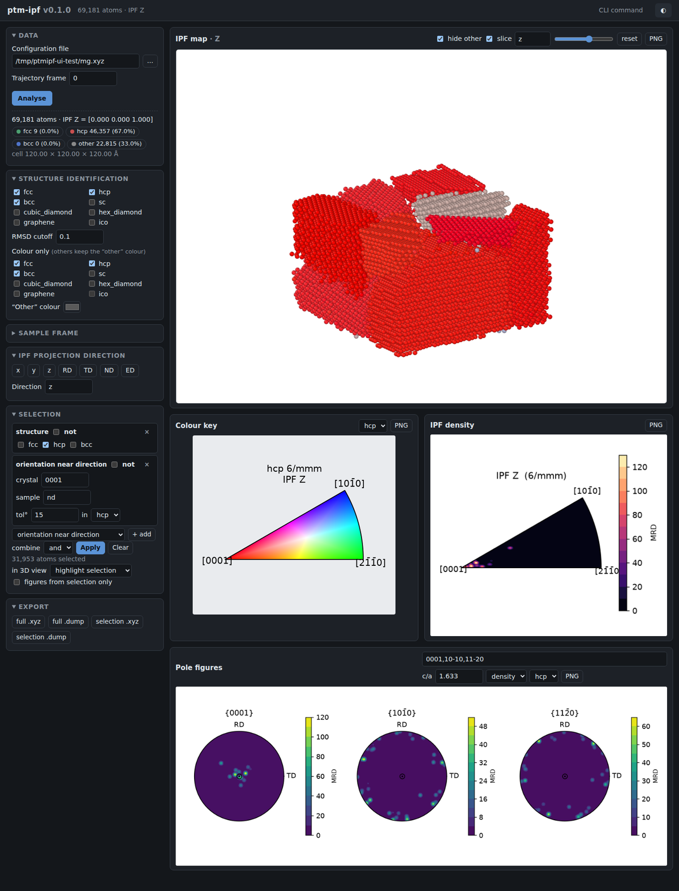

# Web interface

`ptm-ipf` ships a local web interface that wraps the whole toolchain — PTM
structure identification, IPF colouring, the colour key, pole figures, the IPF
density plot, atom selections and file export — behind an interactive page:

```bash
ptmipf-ui mg.dump                    # analyse a file and open the browser
python -m ptmipf.webui mg.dump       # the same, without the console script
python -m ptmipf.webui --root ~/simulations --port 8465
```

*(Packaging note: the console script is a one-line entry point,
`ptmipf-ui = "ptmipf.webui:main"` under `[project.scripts]`.)*


The interface follows the browser's light or dark theme (a toggle is in the
header):



## What it does

* **Load a configuration** with the path box or the built-in file browser,
  pick a trajectory frame, and press *Analyse*. Atom count, cell dimensions
  and the per-structure PTM counts appear once the analysis finishes; long
  runs show a live status instead of a frozen page.
* **Every CLI option is a control**: the structures PTM identifies, the RMSD
  cutoff, colour-only, the "other" colour, the RD/TD/ND/ED sample frame
  definitions, and the IPF projection direction (axis buttons or any vector).
  Changing only the projection direction or the colouring re-uses the cached
  PTM result and updates in a fraction of a second; PTM re-runs only when the
  file, the structure set, the cutoff or the frame change.
* **3D view**: the IPF-coloured atoms, rendered server-side by OVITO from the
  cached result. Drag to orbit, scroll to zoom, cut the cell open with the
  slice control, and hide the unidentified grain-boundary atoms. Click an
  atom to see its position, structure, RMSD and orientation — and to use it
  as a misorientation reference.
* **Figures**: the IPF colour key, pole figures for any pole families
  (`0001,10-10,11-20`, with a c/a input for non-ideal lattices, density or
  scatter mode) and the IPF orientation density, regenerated whenever the
  settings change. Every figure and the rendered view have a PNG download
  button, and the coloured configuration exports to `.xyz` or `.dump`.
* **Selections**: build up a selection from structure, particle type, RMSD
  range, spatial slab, orientation within a tolerance of a sample direction
  ("the basal-oriented grains"), or misorientation from a reference
  orientation or a clicked atom. Criteria combine with *and*/*or* and each
  can be inverted; the selected atom count updates live. The selection can be
  highlighted (or shown alone) in the 3D view, the pole figures and IPF
  density can be restricted to it, and it exports to its own `.xyz`/`.dump`.
* **Reproducibility**: the *CLI command* button prints the `ptmipf` command
  line — selection flags included — that reproduces the current session, so
  interactive exploration turns directly into a scriptable analysis.

## Design notes

The server is standard library only (`http.server`), so the web interface
adds no dependencies beyond what `ptm-ipf` already needs; the front end is a
single static page with no JavaScript frameworks. It binds to `127.0.0.1` and
serves files only from below the `--root` directory (by default the input
file's directory). It is a single-user local tool, not something to expose on
a network.

Rendering is done by OVITO on the server from the cached analysis result, so
orbiting the view never re-runs PTM, and what the browser shows is what
`ptmipf --render` writes. All plots are produced by the same functions as the
CLI, which keeps the two front ends pixel-identical.
